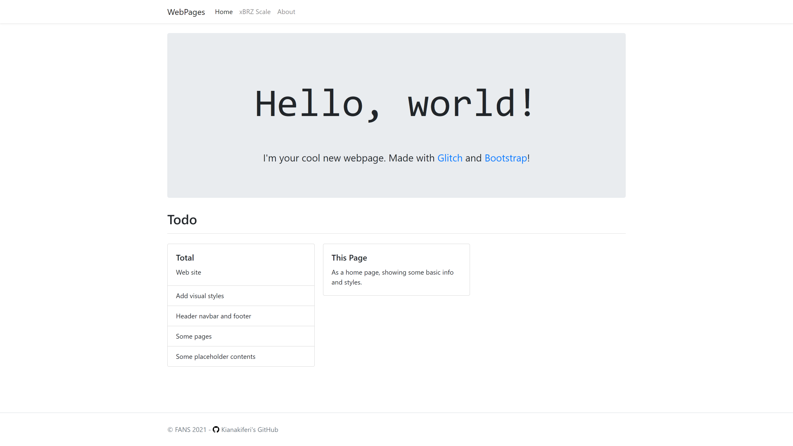
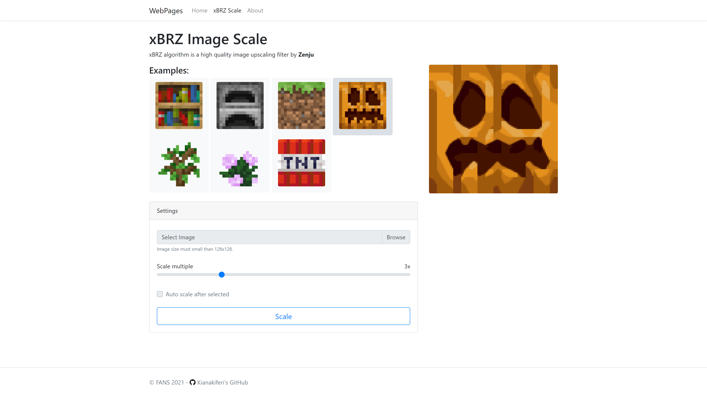
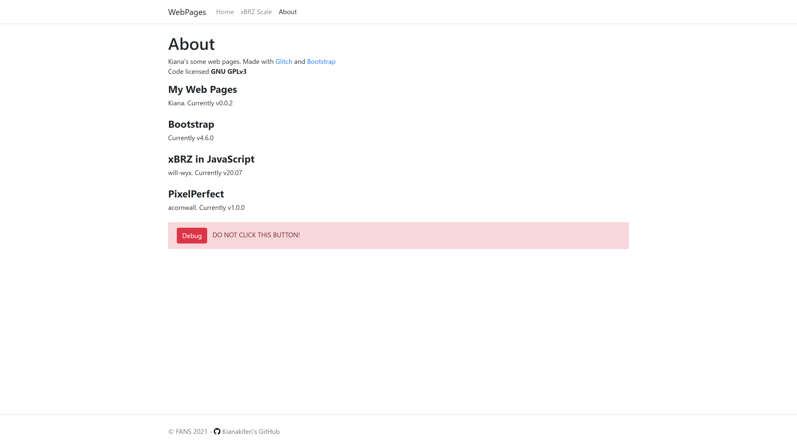

Kiana's Web Pages
=================

xBRZ image scaler and some pages, Using HTML,JavaScript, jQuery, Bootstrap...

## Pages

- **index.html**
  Website starts here. with navigation bar, you can navigate between pages  

- **home.html**
  Home page.

- **xBRZ.html**
  Scale images using xBRZ, and image toggle switches.

- **about.html**
  About this website.

- **images**
  some images.

- **css**
- **js**
- **libs**
  website styles and scripts.

## xBRZ JavaScript Usage
```JavaScript
<canvas id="canvasScaled"></canvas>

<script type="module">
import {
    ScaleImageAndDraw
} from '/js/scale.js'

ScaleImageAndDraw("/images/bookshelf.png"); 
</script>
```
Import and draw~

## [Screenshots](https://github.com/Kianakiferi/My-Web-Pages/tree/main/screenshots)



## License

[GNU GPLv3](https://github.com/Kianakiferi/My-Web-Pages/blob/glitch/LICENSE)
